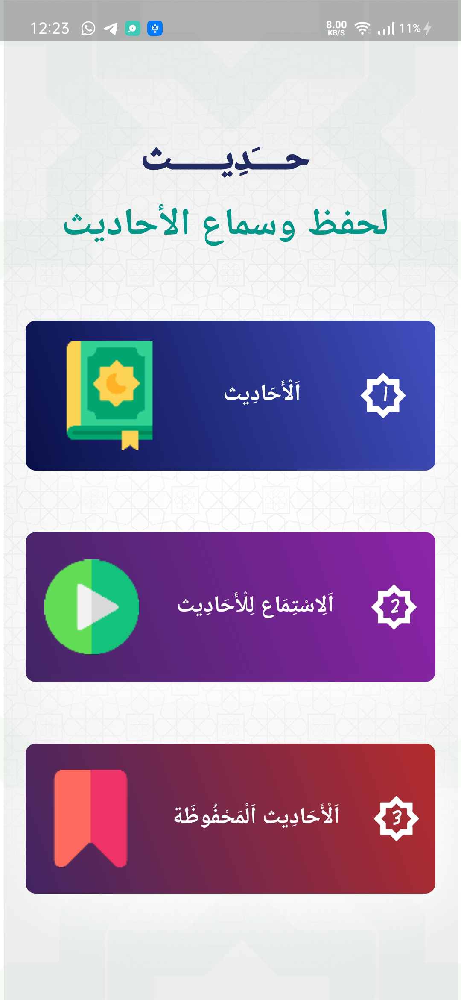
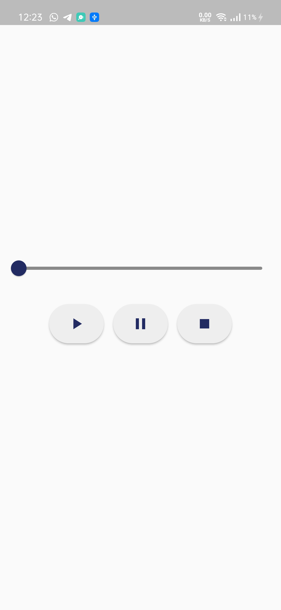
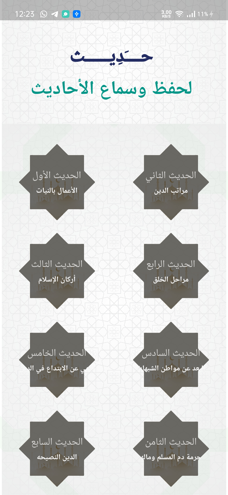
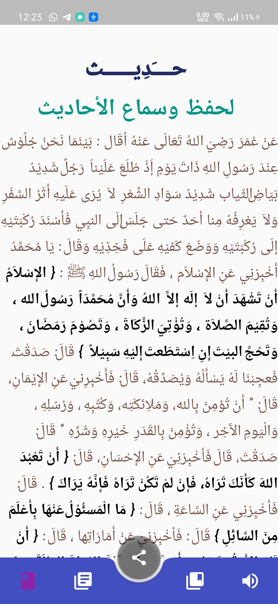

hadith App with AudioPlayer [MVC pattern] 👨🏻‍💻

hadith App app is open-source  app for Android & ios. It is built with Dart on Google's Flutter Framework.

<b>Hadith - حديـــــــــث</b>

## Benfit
- [🖥] # Screens 🖥
- [🆗] Splash Screen
- [🆗] Home Screen
- [🆗] hadith Screen
- [🆗] Fav Video Screen
- [🆗] Audio hadith Screen
--------------------------------
- [x] [AudioPlayer]
- [x] [path_provider]
- [x] [flutter_svg]
- [x] [share]

--------------------------------
- [x] MVC patterns
-------------------------------
- [🖥] # Deal With 🖥
- [x] Deal With RegExp
- [x] Deal With RichText
- [x] Deal With Duration
- [x] Deal With AudioCache
- [x] Deal With localFilePath
- [x] Deal With Map Function

------------------------------
- [🖥] # Play  
- [x] Pause
- [x] Stop
--------------------------

## Snapshots

|1|2|
|------|-------|
|||

|3|4|
|------|-------|
|||

|5|6|
|------|-------|
|||

## Dependencies 
 -  `path_provider:`
 -  `flutter_svg:`
 -  `audioplayers:`
 -  `share:`

